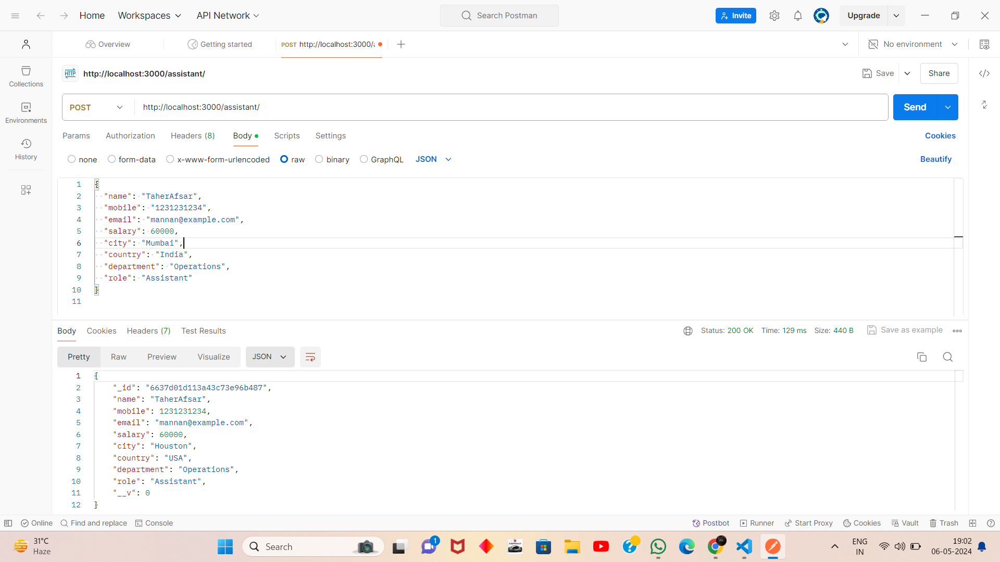
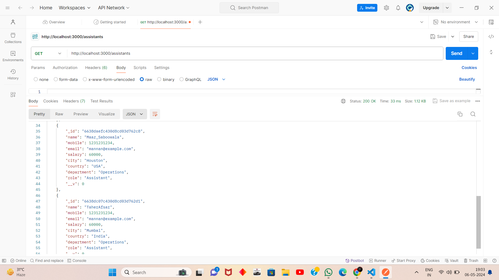
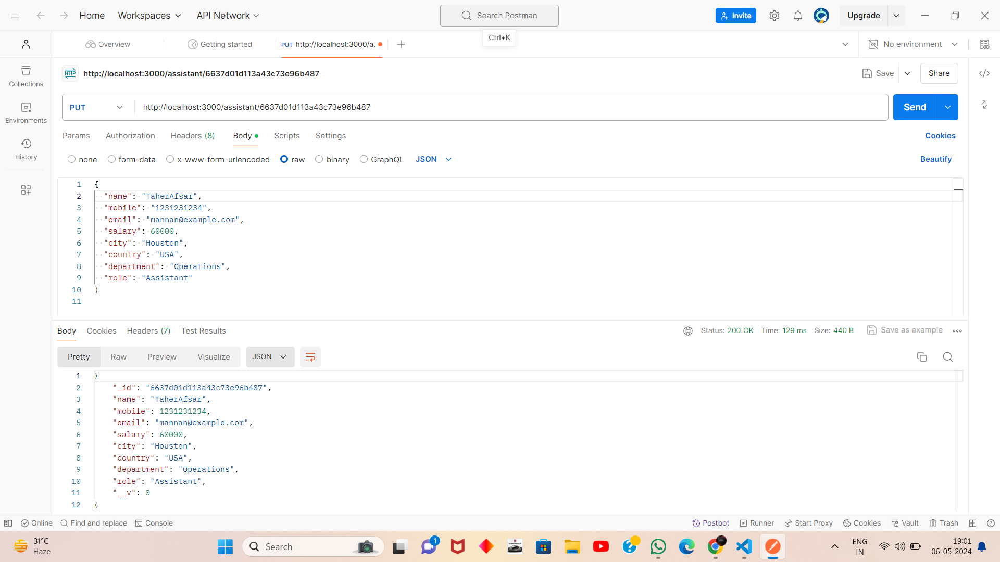
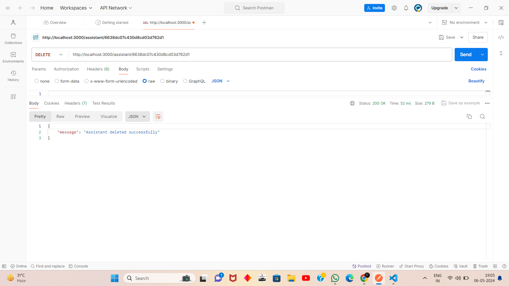

Certainly! Here's the README file with URLs added:

# Assistant Management API

This API provides endpoints to manage assistants, including creating, retrieving, updating, and deleting assistant records.

## Endpoints

### Create Assistant
- **Method:** POST
- **Endpoint:** `/assistant`
- **Description:** Creates a new assistant record.
- **Request Body:** Provided in the API documentation.
- **Response:** Returns the created assistant object.

- 

### Get Assistant by ID
- **Method:** GET
- **Endpoint:** `/assistant/:assistant_id`
- **Description:** Retrieves an assistant record by its ID.
- **Response:** Returns the assistant object with the specified ID.

  

### Get All Assistants
- **Method:** GET
- **Endpoint:** `/assistants`
- **Description:** Retrieves all assistant records.
- **Response:** Returns an array of all assistant objects.

### Update Assistant
- **Method:** PUT
- **Endpoint:** `/assistant/:assistant_id`
- **Description:** Updates an existing assistant record by its ID.
- **Request Body:** Include the fields to be updated.
- **Response:** Returns the updated assistant object.

### Delete Assistant
- **Method:** DELETE
- **Endpoint:** `/assistant/:assistant_id`
- **Description:** Deletes an assistant record by its ID.
- **Response:** Returns a success message upon successful deletion.

## Model
The `Assistant` model is used to represent assistant records. It has the following schema:
- **name:** String (required)
- **mobile:** Number (required)
- **email:** String (required)
- **salary:** Number (optional)
- **city:** String (required)
- **country:** String (required)
- **department:** String (required)
- **role:** String (required)

## Error Handling
- If an error occurs during API operations, an appropriate error response is returned, including an error message and status code.

For further details on usage and implementation, refer to the code documentation.

**Note:** Ensure that you have MongoDB properly set up and running, and the `Assistant` model correctly defined before using these endpoints.

**URLs:**
- Create Assistant: `POST http://localhost:3000/assistant`
- Get Assistant by ID: `GET http://localhost:3000/assistant/:assistant_id`
- Get All Assistants: `GET http://localhost:3000/assistants`
- Update Assistant: `PUT http://localhost:3000/assistant/:assistant_id`
- Delete Assistant: `DELETE http://localhost:3000/assistant/:assistant_id`
